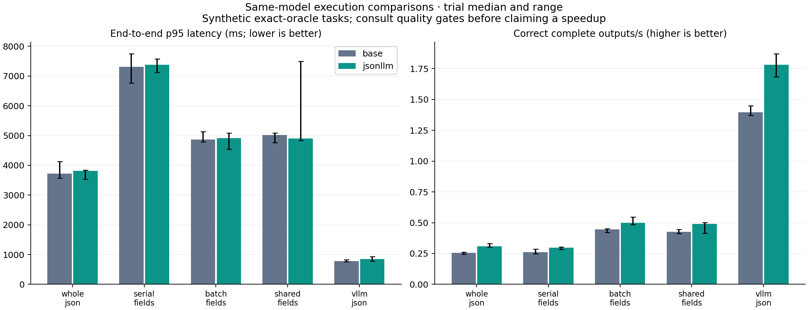
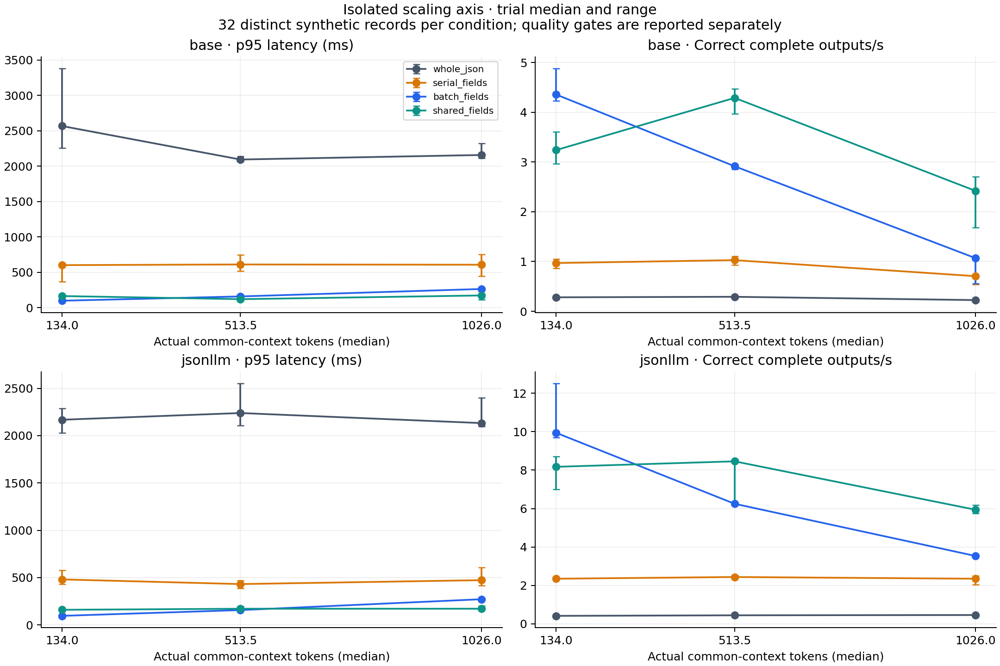

# Execution design benchmark: completed results

The completed study supports batching independent typed fields. It does **not** establish a general quality-preserving advantage for the shared-prefix runtime over whole-JSON generation. Prefix sharing reduced repeated context work but was slower than ordinary batching on the short-context core set. It became faster in the longer-context sweep. Exact-answer quality, long scalar decoding, and the record-level lock remain substantial limitations.

This is a separate experiment from the [historical training evaluation](evaluation.md). That evaluation compared weights under one runtime on its original dataset. This study compares execution methods within each frozen model on new synthetic tasks. Its lower accuracy must not be replaced by the earlier 100% trained-model score.

## Coverage and controls

All **540 sealed formal trials** completed: 50 core, 432 scaling, 32 load, 20 bounded topology, and 6 completed-UI trials. There were 30,336 formal request executions. Ten final development trials are archived separately and excluded from conclusions. No scheduled trial was omitted for budget. No formal measurement was rerun or selected by its outcome.

The input collection has 1,088 eligible records, balanced between English and Korean. This includes 64 development records. There is no overlap with the 10,000 original training/validation/test records. A further 32 records in the nominal 1,536-context-token condition exceeded the 2,048-token contract and were excluded from every method before inference. They remain in the exclusion file. Core quality uses 256 distinct records, not 1,280 independent observations from five timing repeats. Each scaling condition has 32 records and three repeats. Load uses the first 64 core records; topology and application each use 64 records per condition with one timing trial.

Both models used the same H100 80 GB. Four eager methods used matched FP16, tokenizer, greedy decisions, deterministic PyTorch/cuDNN settings, and cuBLAS workspace `:4096:8`. The separate vLLM FP16 baseline uses optimized engine defaults, fresh request cache salts, loopback HTTP, and per-request timing telemetry. It is a practical serving comparison, not an isolated test of prefix reuse. The [protocol](design-benchmark-protocol.md) specifies prompts, budgets, timing, and gates.

Measurement source: `b241f1bd9f05649429ad798feaab5566d74bd190`. Reporting source: `f56b0ba` (a later reporting-only commit). Seal SHA-256: `71a64f3a8b4d6bcb1ecd11d95d98da672631609971150173ebdb40fc5e725b47`. Data manifest SHA-256: `c0ed45608188f10bf1437e9e00d11cd5484aaa1b3e3a835aba6a14a8182adb57`.

The base revision is `851bf6e806efd8d0a36b00ddf55e13ccb7b8cd0a`. JSONLLM inference remains pinned to `2a020c2cddaec6fcb86ef0d6665f1ee11f699738`. Documentation commits do not change that inference revision, model weights, adapter, tokenizer, or original data.

## Core results

These are medians across five trials. Latency includes formatting, inference, parsing, validation, and failures. Correct/s counts exact, complete records. All core outputs were schema-valid and all core requests completed without errors. This does not imply correct answers.

| Model | Method | Exact accuracy | p50 ms | p95 ms | Correct/s |
|---|---|---:|---:|---:|---:|
| Base | Whole JSON | 63.28% | 2,232 | 3,725 | 0.254 |
| Base | Serial fields | 57.81% | 622 | 7,309 | 0.261 |
| Base | Batch fields | 57.81% | 196 | 4,869 | 0.446 |
| Base | Shared fields | 57.81% | 256 | 5,020 | 0.427 |
| Base | vLLM JSON | 57.03% | 323 | 778 | 1.397 |
| JSONLLM | Whole JSON | 78.52% | 2,262 | 3,816 | 0.308 |
| JSONLLM | Serial fields | 64.84% | 595 | 7,376 | 0.297 |
| JSONLLM | Batch fields | 65.23% | 191 | 4,913 | 0.499 |
| JSONLLM | Shared fields | 65.23% | 250 | 4,900 | 0.490 |
| JSONLLM | vLLM JSON | 75.39% | 323 | 851 | 1.781 |

Batching versus serial fields had a paired median-record latency ratio of **3.14×** for both models: base 95% interval [1.98, 4.48], JSONLLM [1.94, 4.54]. Accuracy was unchanged for the base and improved by one of 256 records for JSONLLM. These comparisons pass both the point and conservative quality gates on this sample. Shared fields also beat serial fields, about 2.35×, with the same quality conclusion.

Sharing versus ordinary batching had ratios **0.748×** for base [0.693, 0.805] and **0.749×** for JSONLLM [0.685, 0.823]. A ratio below one means slower. Thus shared execution took about 34% longer at the paired median on this core set, without an accuracy benefit. Correct throughput was also slightly lower. The small difference in JSONLLM p95 does not reverse the median result; the full trial range is retained.

Shared fields versus whole JSON had much lower median latency (8.56× base, 8.82× JSONLLM), but accuracy fell by **5.47 and 13.28 percentage points**. Both fail the fixed two-percentage-point quality-loss criterion. Tail latency also worsened: approximately 5 seconds versus 3.8 seconds. The mixture contains cheap selections and expensive scalar strings; median speed alone hides that tail.

vLLM produced the highest core correct throughput and much lower p95. Its accuracy fell by 6.25 points for base and 3.13 points for JSONLLM relative to eager whole JSON. Those comparisons also fail the quality gate. Kernel and serving differences prevent attributing this practical result to prefix sharing.

## Quality by task and language

The trained model's core exact-record accuracy illustrates the tradeoff. Each type has 64 distinct records; each language has 128. All fields in a record must be correct.

| Method | Selection | Dependency | Number | String | English | Korean |
|---|---:|---:|---:|---:|---:|---:|
| Whole JSON | 23.44% | 90.63% | 100% | 100% | 79.69% | 77.34% |
| Serial fields | 39.06% | 21.88% | 98.44% | 100% | 67.97% | 61.72% |
| Batch fields | 40.63% | 21.88% | 98.44% | 100% | 68.75% | 61.72% |
| Shared fields | 40.63% | 21.88% | 98.44% | 100% | 68.75% | 61.72% |
| vLLM JSON | 25.00% | 81.25% | 95.31% | 100% | 77.34% | 73.44% |

The dependency loss is material. Constraints ensured valid scalar types; they did not ensure the right semantic decisions. Fine-tuning targeted scalar answers, and the whole-object prompt differs from the field prompt. These observations do not isolate training-format effects. Both models' complete breakdowns, Wilson intervals, and type/language p50/p95/p99 are in [report.json](benchmarks/design-20261004/report.json).

## Where sharing helped and where it did not

The context sweep fixes eight independent fields and four source entries. Measured median common-context lengths were 134, 513.5, and 1,026 tokens. Shared/batch accuracy was identical at each condition.

| Actual context tokens | Base batch/shared latency ratio [95% interval] | JSONLLM ratio [95% interval] |
|---:|---:|---:|
| 134 | 0.860 [0.819, 0.877] | 0.894 [0.880, 0.908] |
| 513.5 | 1.511 [1.506, 1.524] | 1.463 [1.430, 1.483] |
| 1,026 | 2.396 [2.313, 2.443] | 1.639 [1.631, 1.660] |

These are observed timing gains at longer contexts with no observed accuracy loss. They are exploratory: 32 unique records give a 10.72% Wilson upper bound on possible loss even with zero observed losses. The conservative 2% quality gate cannot pass at that sample size. No threshold was relaxed.

The other four axes are all retained, including unfavorable conditions:

- [Field width](benchmarks/design-20261004/scale-width.png): shared/batch ratios range from 0.70 to 1.17 across widths 1/4/8/16. More fields do not guarantee a gain; exact full-record quality also deteriorates with width.
- [Dependency depth](benchmarks/design-20261004/scale-depth.png): sharing is slower at the paired median across all tested depths (ratios 0.67–0.88). Additional waves constrain parallelism. At depth eight, correct throughput approaches zero for typed methods in this workload.
- [Choice count](benchmarks/design-20261004/scale-choices.png): sharing is slower than batching at all tested choice counts (0.67–0.99). Quality and timing vary across separately generated conditions.
- [Scalar length](benchmarks/design-20261004/scale-text_words.png): one-field copied strings have reference lengths of 10/34/98 tokens. Typed methods take about 9–10 seconds at the longest level versus about 3.2 seconds for whole JSON. Sharing and batching are nearly equal because there is only one field. At the longest level, all trained-model methods score 93.75%; base whole JSON scores 96.88% versus 93.75% for typed methods. Typed execution is slower without an accuracy benefit.

The core shared runtime evaluated a median 148 common tokens per record, versus 1,184 for batch/serial fields. It copied a median 454,033,408 cache bytes per record. This supports the claimed reduction in repeated context work while exposing copying overhead. It does not by itself prove the cause of each latency difference. Core JSONLLM output totals were 8,074 tokens per trial for field methods, 20,346 for whole JSON, and 18,420 for vLLM. These count different serialization contracts and are not equal-output-token comparisons.

## Load, queues, first usable output, and memory

Every finite load request completed with schema-valid output; no load timeout was observed. Accuracy was stable within each method across loads. Each condition used only 64 records once, so it does not establish sustained serving capacity.

For JSONLLM shared fields, closed-loop concurrency 1→8 reduced correct throughput from 0.538 to 0.499/s and increased p95 from 4.69 to 12.56 seconds. The lock-wait p95 reached 12.28 seconds at concurrency eight. The original record lock remains in place. vLLM increased correct throughput from 1.812 to 5.380/s, with p95 0.75→1.82 seconds and accuracy 73.44% versus shared fields' 68.75% on these 64 inputs.

At four offered requests/s, shared JSONLLM had 75.46-second p95, 70.77-second lock-wait p95, and 0.448 correct outputs/s. vLLM had 1.15-second p95 and 2.886 correct outputs/s. All 64 requests eventually completed; the backlog is still a limitation. The open-loop client pool size of 128 is not 128-way useful GPU execution. Dispatch wait, runtime lock wait, and server scheduler wait remain separate fields; missing timing is never treated as zero.

Core JSONLLM's median first validated field-wave time was 74 ms for serial, 96 ms for batch, and 160 ms for shared execution. Whole JSON and vLLM exposed only complete objects, at 2,262 and 323 ms respectively. This internal timestamp can precede a later error. It is not browser rendering or streamed UI latency; the public API still returns atomically.

Core peak allocated memory for eager methods was about 8.09–8.67 GiB. Median sampled device-wide peaks were about 12.20–12.72 GiB. vLLM reserved about 59.54–60.05 GiB under the fixed 0.75 utilization setting; its allocator peak was not measured. Reservation and active tensor memory are different quantities. Sampling every 200 ms can miss brief peaks. These observations are not minimum hardware requirements. Loading, warmup, schema preparation, and server startup are excluded from request timings but preserved per trial and in the evidence archive.

## Bounded topology and completed UI

Topology records ask for existence, kind, and links for eight candidate nodes. Schema validity and graph validity are separate. All three typed-field methods scored **0/64 exact records** for both tree and workflow tasks under both models. Most resulting graphs were also invalid. Fast typed timings here do not establish useful topology generation.

| Task | Model | Whole JSON exact | Shared fields exact | vLLM exact | vLLM errors |
|---|---|---:|---:|---:|---:|
| Tree | Base | 42.19% | 0% | 51.56% | 1 |
| Tree | JSONLLM | 25.00% | 0% | 35.94% | 0 |
| Workflow | Base | 40.63% | 0% | 28.13% | 24 |
| Workflow | JSONLLM | 28.13% | 0% | 20.31% | 0 |

All 25 formal errors were `truncated_output` from base vLLM topology trials. They remain failures in accuracy, validity, throughput, and latency. There were zero classified timeouts and 812 graph-invalid executions across topology methods. Graph-invalid counts and exceptions are different categories; their counts must not be added as if disjoint. Whole-object methods also produced graph-invalid outputs. The raw archive preserves every output and error.

The separate application trial compares direct generation of a fixed completed `DecisionPanel` with typed decisions plus code assembly. JSONLLM whole/shared/vLLM accuracy was 76.56% / 62.50% / 76.56%, p95 7.40 / 4.63 / 0.96 seconds, and correct throughput 0.137 / 0.491 / 1.082 per second. Shared assembly was faster than eager whole-tree serialization but lost 14.06 accuracy points. The base lost 7.81 points. This fails the quality criterion. vLLM matched the trained whole-JSON point accuracy, but one 64-record trial cannot meet the conservative 2% loss bound. No workflow was executed and no browser UI was rendered or evaluated for usefulness.

## Uncertainty, failures, and limits

The report uses 2,000 paired bootstrap draws over unique record IDs, with fixed seed 20261005. Repeats are clustered within each record. Ratios use medians of per-record timing summaries; they need not equal ratios of the displayed median trial quantiles. Zero observed quality differences can yield degenerate bootstrap intervals. A separate Wilson upper bound counts possible losses without offsetting them by gains. The gate requires 100% schema/graph validity and at most two points of quality loss. Intervals are nominal 95%, with no correction for multiple exploratory comparisons. p99 is exploratory at these sample sizes.

The final actual-weight FP16 cache gates passed 105 comparisons per model at unchanged tolerances. Before sealing, a default-environment trained FP16 gate failed. Serialization-name validation, CPU FLA fixtures, vLLM ninja PATH, and error timing also required repairs. Original diagnostics remain locally preserved; the archive includes reasons and file hashes, not private operation logs. No formal result was replaced after seeing its quality.

Optimized FLA delta-rule kernels were active. Causal convolution used the Transformers reference functions in the eager environment. Conclusions therefore apply to this implementation and environment. Default runtime CUDA events/counters and memory sampling were included; detailed profiling was disabled. No external profiler or large transfer ran during timing. Hardware, package versions, both gate reports, and tokenizer/schema preflight evidence are included.

No planned formal block remains unexecuted. Unmeasured scope includes the excluded 1,536-token context group, larger contexts/models/GPUs, alternate precisions, a fully optimized eager convolution backend, unlocked concurrent records, sustained arrivals beyond these finite tests, free-form tree/workflow synthesis, workflow execution, browser rendering, and human UI quality. The study provides no general factual-reliability or unrestricted GenUI guarantee. No retraining or model search was performed.

## Archive, checks, and cost

The [measurement archive](benchmarks/design-20261004/README.md) contains every final development/formal raw record in gzip JSONL, per-trial summaries and warmups, exact inputs and exclusions, the sealed schedule/admission decisions, full aggregate metrics, six PNG/SVG figures, and SHA-256 manifests. Original machine paths and process identifiers are excluded from exported summaries. [Validation and recovery](benchmarks/design-20261004/evidence/validation.json) record the completed checks. The source model/adapter/original data passed fresh local SHA-256 and remote hash/size checks for all 13 immutable files.

Existing automation recovered **4,054 files**, and independent local verification matched every recovery SHA. The Pod and volume were deleted, a fresh provider inventory confirmed absence, and the local controller and caffeinate exited. No replacement resource was created.

Additional conservative all-in cost was **$64.4384**, including setup, failures, storage, and recovery; paid teacher API cost was **$0**. The historical campaign estimate was **$29.0707**, giving a cumulative estimate of **$93.5091**. These are estimates, not a provider invoice. The additional $100 cap was respected. GitHub and Hugging Face remain private; this is not a public release.
