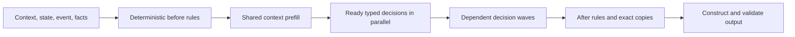

# Design and scope

JSONLLM moves known structure out of the model's output sequence. An application supplies a specification containing typed decisions, dependencies, state rules, and a view. The model resolves the semantic values; the runtime evaluates the remaining expressions and constructs JSON.

## Model work and runtime work

`compile_ui(spec)` validates a `genui-v1` specification and returns a compiled object with its serialized source and fingerprint. `run_ui(compiled, context, state, event, facts, predictor=...)` evaluates one event. It returns `output` and `diagnostics`. The output contains `component`, `props`, and `state`. Invalid runtime inputs or decision values produce `output=None` with diagnostic errors; the runtime does not repair a failed result into a plausible UI.

Choice values are mapped to single-token labels. The model scores allowed labels. Free scalar values use constrained decoding. Explicit `depends_on` edges define which answers a later question can see. Conditional decisions include an explicit `otherwise` value. Computable values such as totals and copies from authoritative facts remain deterministic expressions.

The application must register components and write the specification. The runtime currently produces one registered view and its props/state. Nested JSON values can occur inside this contract; this does not establish arbitrary tree topology generation or workflow synthesis.

## Shared context

The `shared-context-v3` prompt contract separates common user/UI context from field questions. Token-boundary checks require their concatenation to equal the complete chat-template tokenization. This preserves the training/inference contract rather than assuming separately tokenized fragments are interchangeable.

Qwen3.5 uses a hybrid cache. Branching must preserve both attention cache and recurrent state. The runtime copies the common cache for independent field questions, batches compatible questions, then runs later dependency waves with their answers. A one-decision request can skip shared-prefill overhead. Prompt strings and the frozen model/data were preserved when the package was renamed.

Independent fields within one record can run together. Records use a lock around the model session. This implementation is not a continuous-batching server; increasing request concurrency can add waiting and reduce throughput, as the recorded concurrency-8 experiment shows.

## Research questions

The hypothesis is that an execution-oriented model interface can reduce serial generation work when structure is known and many decisions are independent. The current experiment establishes that a small fine-tuned model can participate in this restricted interface. It does not isolate the causal speedup of each design choice.

Open questions include dynamic topology, deeper dependency graphs, unseen schemas, larger decision vocabularies, broad factual grounding, inter-request batching, cache-copy overhead, and training a model natively for this interface. A graph's critical dependency path remains serial even when its independent branches can run together.

The package is a cleaned extraction of the author's TypeLLM Model experimental implementation. It is not a new base-model architecture or a claim of novelty for typed generation in general.
